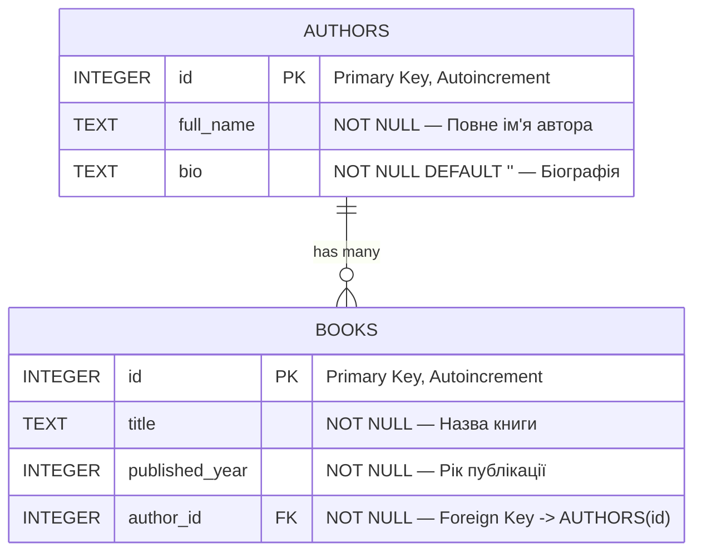

# Діаграма сутність-зв'язок (ER Diagram)

Діаграма відображає структуру бази даних бібліотеки з двома сутностями:
**Author** (автор) та **Book** (книга), пов'язаними відношенням «один до багатьох».

## Опис зв'язків

| Зв'язок | Тип | Опис |
|---------|-----|------|
| `AUTHORS` → `BOOKS` | One-to-Many | Один автор може мати багато книг |
| `BOOKS.author_id` → `AUTHORS.id` | Foreign Key | Зовнішній ключ з каскадним оновленням та видаленням |
